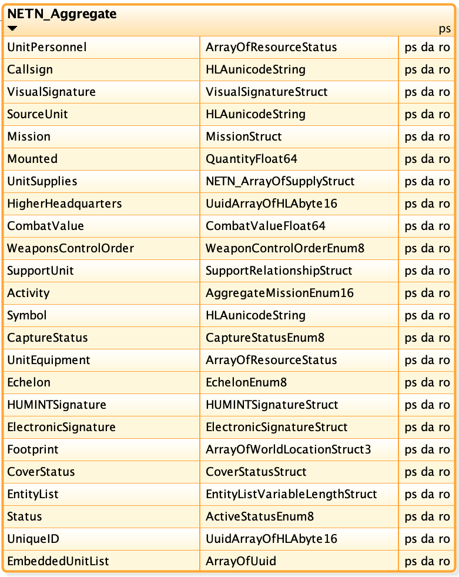

# NETN-Aggregate

The NATO Education and Training Network (NETN) Aggregate FOM Module.

Copyright (C) 2019 NATO/OTAN.
This work is licensed under a [Creative Commons Attribution-NoDerivatives 4.0 International License](LICENCE.md).

## Introduction

The NETN FAFD representation of aggregate entities such as military units is based on the [SISO-STD-001-2015 standard RPR-FOM v2.0](https://www.sisostds.org/). The NETN FOM Module extends the RPR-FOM with a NETN_Aggregate object class which include additional attributes for unique identification of simulated entities.

It is recommended that NETN federates support the NETN extension for Aggregate Entities. For compatibility reasons, NETN federates, that implement NETN extensions of Aggregate Entities, are also required to support RPR-FOM v2.0.

### Purpose

The NETN-Aggregate FOM Module provides a common standard interface for the representation of Units in a federated distributed simulation. The module extends the existing RPR-FOM v2.0 standard with subclasses classes and additional attributes to allow additional information to be associated with simulated aggregate entities.

A unique identification attribute has been included to provide better support for initialization, NETN-TMR and other advanced design patterns requiring unique pre-defined identifiers for simulated entities. NETN federations still allow pure RPR-FOM based federates in the federation but with limited ability to interoperate in some NETN design aspects. 

### Scope

The `NETN_Aggregate` object class is a specialization/subclass of the RPR-FOM object class `BaseEntity.AggregateEntity` and defines additional attributes.

|Attribute|Description|
|---|---|
|UnitPersonnel|This summarizes the health status of personnel comprising the aggregate.|
|Callsign||
|VisualSignature||

